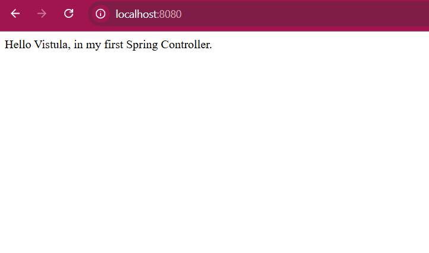
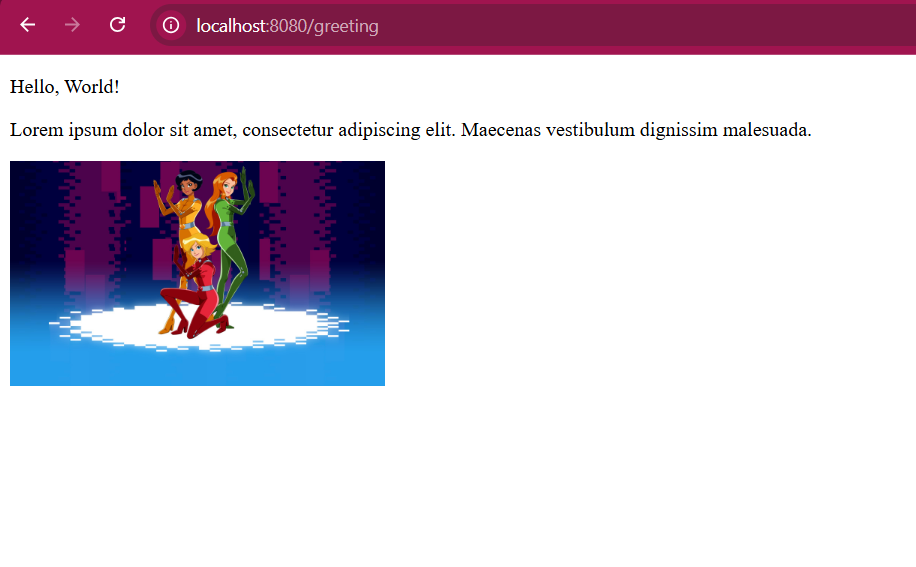
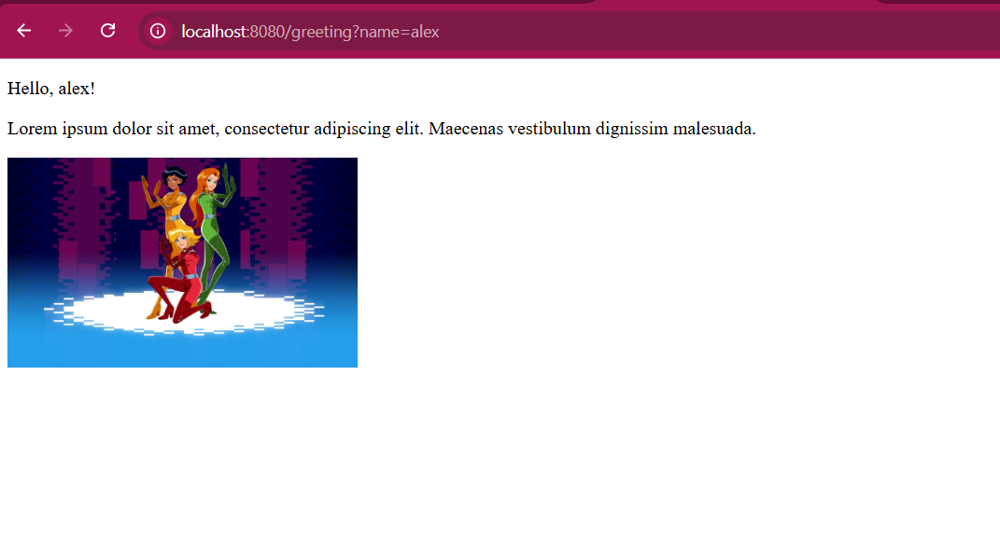

Task 1: First Project Java Spring
A simple web application using Java, Spring Boot, and Thymeleaf.

Technologies
Java 21

Spring Boot

Thymeleaf

Maven

How to Run
Open in IDE.

Execute command:

Bash

./mvnw spring-boot:run
Server URL: http://localhost:8080

Endpoints
1. Root Page
   URL: http://localhost:8080/

Description: Simple text message.

Screenshot:

2. Greeting (Default)
   URL: http://localhost:8080/greeting

Description: Default greeting page.

Screenshot:

3. Greeting
   URL: http://localhost:8080/greeting?name=Alex

Description: Personalized greeting.

Screenshot: